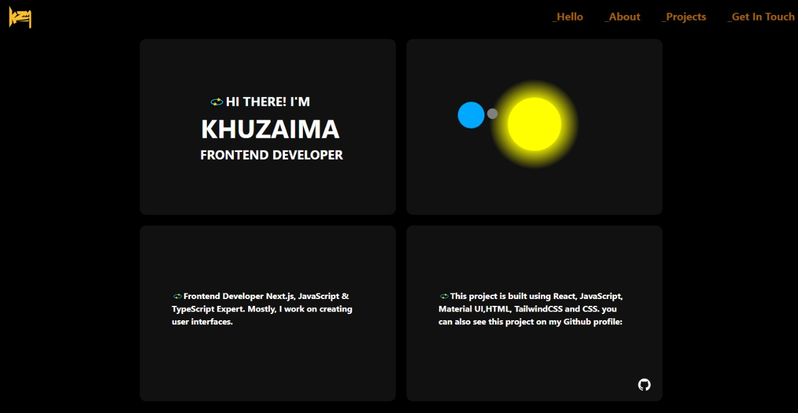
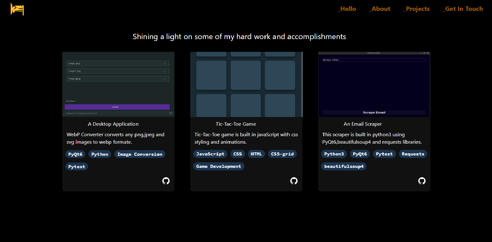
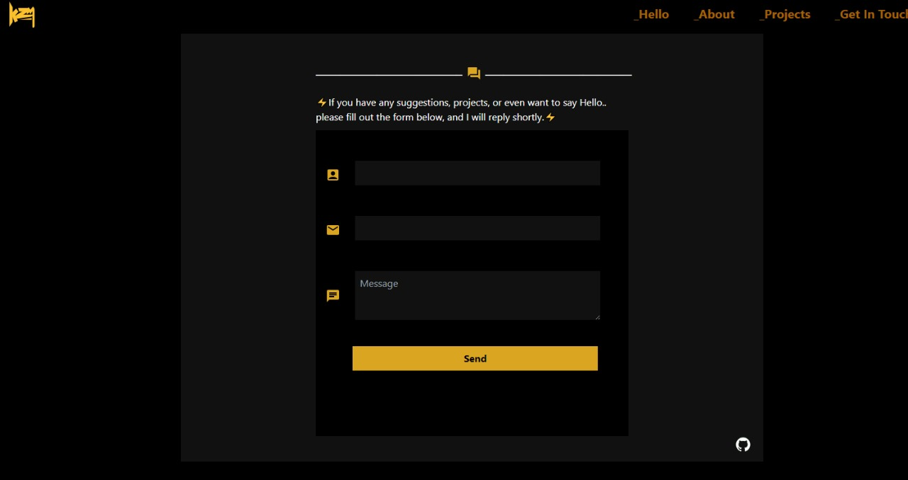
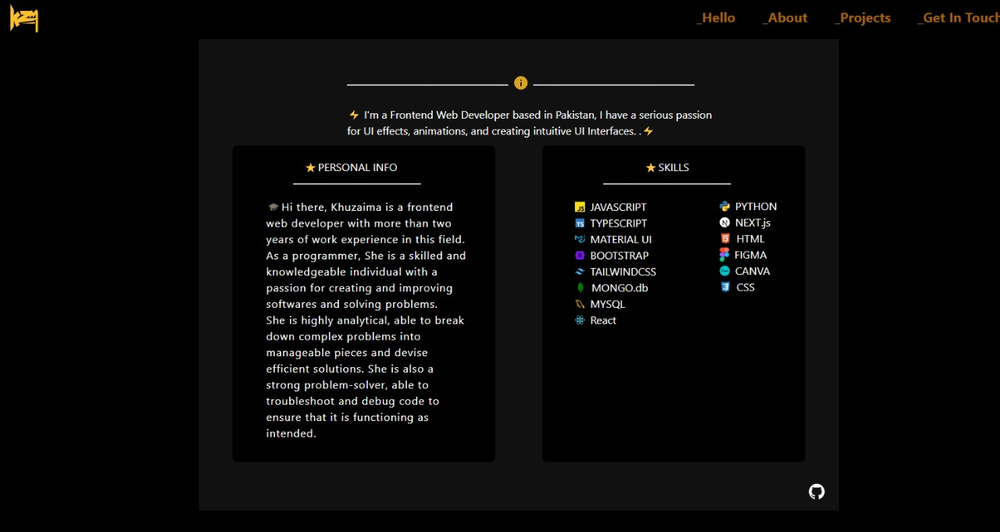

<a name="readme-top"></a>
Live Preview👉:[https://my-portfolio-roan-delta.vercel.app/](https://my-portfolio-roan-delta.vercel.app/)

<div align="center">
  
  <p>
  📹Crafting Connections through Code: Explore my journey, projects, and passions in this immersive portfolio powered by React✨.
      <br/>
      Built by: @kzm
      <br/>
      <a href="https://github.com/kzmfhm/my-portfolio"><strong>Explore the docs »</strong></a>
      <br/>
     </p>
  </div>
   <!-- TABLE OF CONTENTS -->
    <details>
    <summary>Table of Contents</summary>
   <ol>
    <li>
      <a href="#about-the-project">About The Project</a>
      <ul>
        <li><a href="#photos">Photos</a></li>
        <li><a href="#built-with">Built With</a></li>
        <li><a href="#description">Description</a></li>
      </ul>
    </li>
    <li>
      <a href="#getting-started">Getting Started</a>
      <ul>
        <li><a href="#prerequisites">Prerequisites</a></li>
        <li><a href="#installation">Installation</a></li>
      </ul>
    </li>
    <li><a href="#questions">Questions</a></li>
    </ol>

  </details>
  <!-- ABOUT THE PROJECT -->

## About The Project

### Photos









  <p align="right"><a href="#readme-top">back to top</a></p>
  
  ### Built With
  
  
  
  
  
  [](https://tailwindcss.com/)

  <p align="right"><a href="#readme-top">back to top</a></p>
  
  ### Description
  
📹This is more than a portfolio; it's an invitation to explore, learn, and connect. So, immerse yourself and enjoy the journey.

While I wholeheartedly encourage you to utilise my portfolio as a springboard for your own creative ventures, I would like to kindly ask that, in the spirit of fairness and recognition, you provide attribution to Your support in acknowledging the origin of this portfolio is greatly appreciated.

I kindly urge you to abstain from portraying either the portfolio or the projects as products of your own authorship. The energy and time devoted to shaping this portfolio reflect my personal journey and aspirations.

Thank you for your understanding, and for embracing the ethos of creativity, authenticity, and shared respect that underpins our digital community. Your appreciation means a lot!🌟

If you like what you see, I'd be truly grateful if you consider giving it a star 🌟

<h3>TL;DR</h3>
Feel free to fork this repo for your own purposes.

  <p align="right"><a href="#readme-top">back to top</a></p>

<!-- GETTING STARTED -->

## Getting Started

To get a local copy up and running follow these simple example steps.

### Prerequisites

- npm
  ```sh
  npm install npm@latest -g
  ```

### Installation

1. Clone the repo
   ```sh
   git clone https://github.com/kzmfhm/my-portfolio.git
   ```
2. Install NPM packages
   ```sh
   npm install
   ```
    <p align="right"><a href="#readme-top">back to top</a></p>

<!-- QUESTIONS -->

## Questions

If you have any inquiries, don't hesitate to reach out to me via socials or by sending an email from my contact page.
<a href="https://www.linkedin.com/in/khuzaima-n-658b98268/">LinkedIn</a> | <a href="https://github.com/kzmfhm">GitHub</a><br/>
Project Link: [https://github.com/kzmfhm/my-portfolio.git](https://github.com/kzmfhm/my-portfolio.git)

<!-- SUPPORT -->

### ⭐️Support

Give a ⭐️ if this project helped you!

<p align="right"><a href="#readme-top">back to top</a></p>
